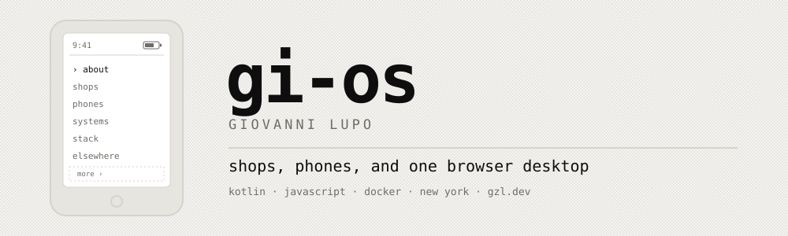

<picture>
  <source media="(prefers-color-scheme: dark)" srcset="assets/header-dark.svg">
  
</picture>

```
$ whoami
giovanni lupo · new york · gio@gi-os.com
$ uptime
shipping since 2015
```

### About

I build small software. Some of it sells things, some runs on phones with no app
store, and some is an operating system that only ever existed in a browser tab. The through line is subtraction. I keep cutting an interface until
what is left does one job.

Kotlin, JavaScript, and more Docker than I planned on.

### Shops

[Shuttle](https://github.com/LR-Paris/Shuttle) is a storefront platform for
brand shops. [Launchpad](https://github.com/LR-Paris/Launchpad) is the dashboard
that creates them, stocks them, and deploys them: one container per shop, path
based routing, orders and inventory as CSV, updates pushed from a browser tab.
Both run at LR Paris, a branded product agency, and both keep real client shops
online.

### Phones

The Light Phone III has a black and white screen and a home screen that is a
list of words. I wrote the apps it does not ship with, and the store they live in.

| | |
| --- | --- |
| [BrightMarket](https://github.com/gi-os/BrightMarket) | The app store, plus an [index](https://github.com/gi-os/brightmarket-index) to submit to it |
| [Roll](https://github.com/gi-os/Roll) | Camera with filters |
| [BrightNotebook](https://github.com/gi-os/BrightNotebook) | Notes, folders, calendar |
| [BrightMusic](https://github.com/gi-os/BrightMusic) | Spotify client |
| [BrightTransit](https://github.com/gi-os/BrightTransit) | NYC subway arrival times |
| [BrightLibrary](https://github.com/gi-os/BrightLibrary) | E-reader with manga and Calibre support |

Fifteen more sit behind those:
[Control](https://github.com/gi-os/BrightControl) ·
[Import](https://github.com/gi-os/BrightImport) ·
[Way](https://github.com/gi-os/BrightWay) ·
[Sports](https://github.com/gi-os/BrightSports) ·
[Authenticator](https://github.com/gi-os/BrightAuthenticator) ·
[thumb](https://github.com/gi-os/brightthumb) ·
[Common](https://github.com/gi-os/BrightCommon) ·
[Solitaire](https://github.com/gi-os/BrightSolitaire) ·
[Sudoku](https://github.com/gi-os/BrightSudoku) ·
[Nonogram](https://github.com/gi-os/BrightNonogram) ·
[News](https://github.com/gi-os/BrightNews) ·
[Recorder](https://github.com/gi-os/BrightRecorder) ·
[Noise](https://github.com/gi-os/BrightNoise) ·
[Passes](https://github.com/gi-os/BrightPasses) ·
[Sync](https://github.com/gi-os/BrightSync)

Kyocera still sells flip phones, so those get a
[launcher](https://github.com/gi-os/PickleLauncher) and a
[solitaire](https://github.com/gi-os/PickleSolitaire) too.

### Systems

```
Gi-OS            a desktop in a browser tab. started 2015, now on version 7
PassportOS       C, for the Passport device
June4 / June7    a virtual secretary, written before the assistants arrived
```

### Odds and ends

```
zip              PWA clone of the LinkedIn Zip puzzle
TeslaHUD         a heads-up display for a car that already has one
basilnethome     the front door to my home server
```

### Stack

```
kotlin           light phone III, kyocera flips
node + react     shuttle, launchpad
docker + nginx   one container per shop, one droplet, no kubernetes
bash             more of it than I plan on
```

### Elsewhere

[gzl.dev](https://gzl.dev) holds the blog, the bookshelf, the film log, and the
photographs. Everything else is on this page.

```
battery ▓▓▓▓▓▓▓░░ 78%     signal ▁▃▅     unread 0
```

No badges, no streak counter, no contribution graph. They do not fit on the screen.
